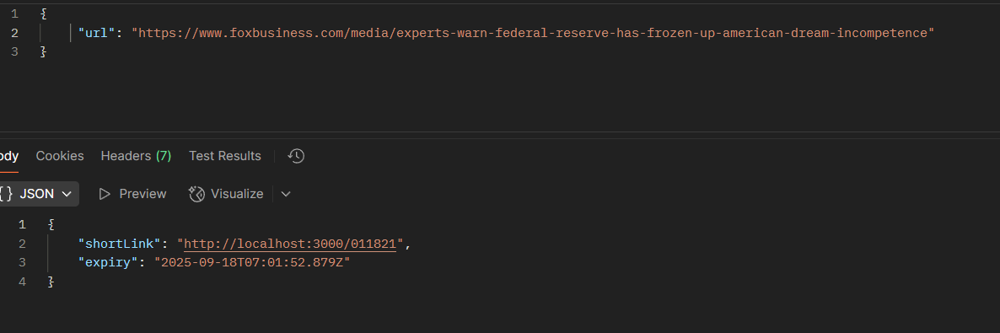
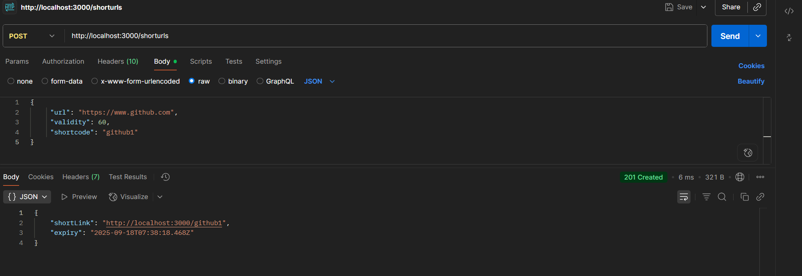
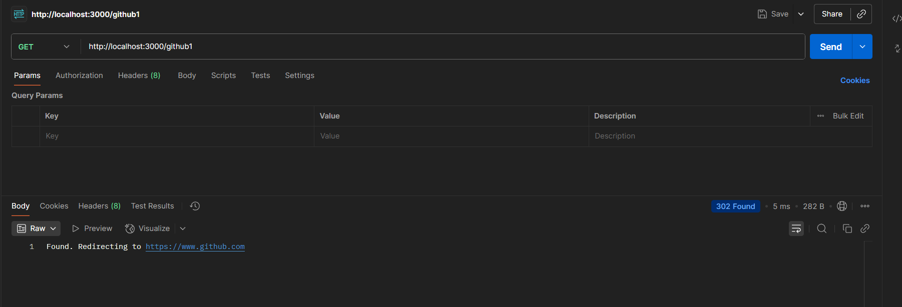
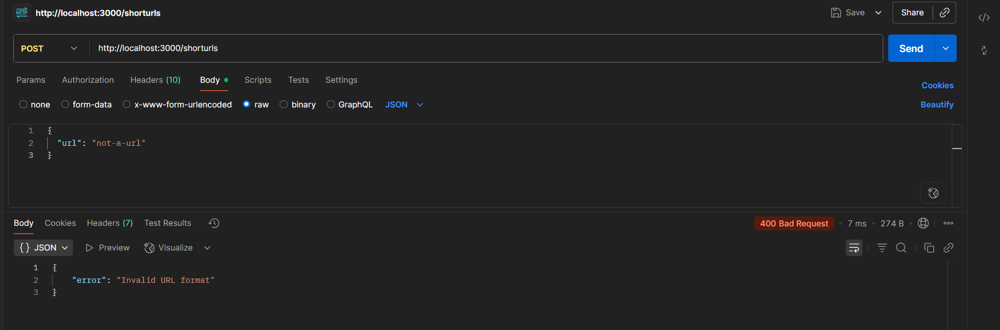
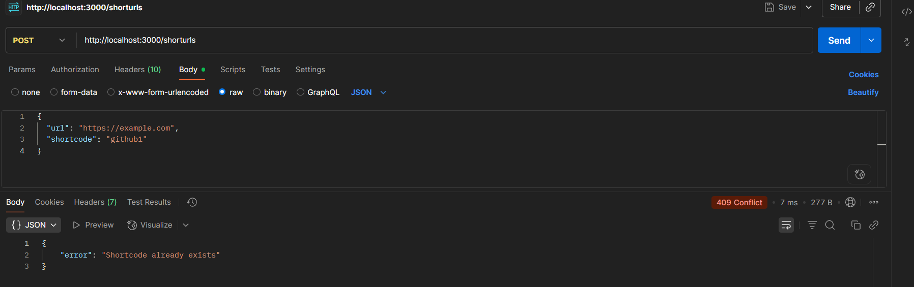

Test Results
Test 1: Create Short URL
Request:
POST http://localhost:3000/shorturls
{
  "url": "https://www.foxbusiness.com/media/experts-warn-federal-reserve-has-frozen-up-american-dream-incompetence"
}

Test 2: Custom Shortcode
Request:
POST http://localhost:3000/shorturls
{
  "url": "https://www.github.com",
  "validity": 60,
  "shortcode": "github1"
}

Test 3: Redirect Test
Request:
GET http://localhost:3000/github1

Test 4: Error Tests
Invalid URL:
POST http://localhost:3000/shorturls
{
  "url": "not-a-url"
}

Duplicate Shortcode:
POST http://localhost:3000/shorturls
{
  "url": "https://example.com",
  "shortcode": "github1"
}
